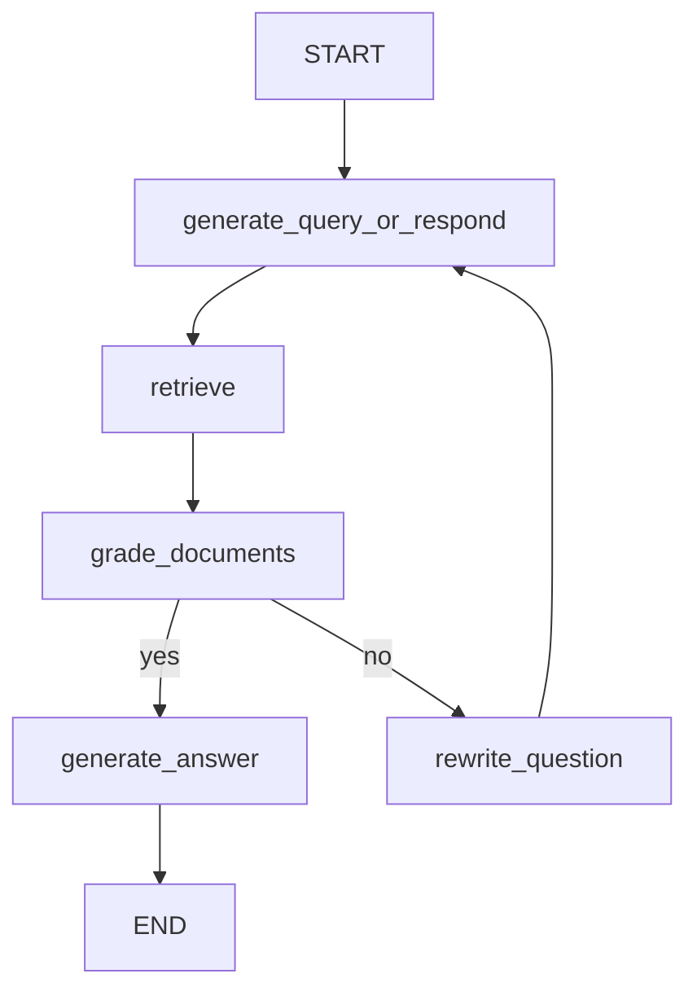

## 《大模型Agent开发实战》（体验课）

# 多模态RAG引擎开发实战

# Part 2.从零到一快速搭建多模态RAG引擎

- 本期公开课四大模块内容


- 【演示】实操项目一：从零到一快速搭建多模态RAG系统

<video src="https://ml2022.oss-cn-hangzhou.aliyuncs.com/74cfd666d005af475500d97302823538_raw.mp4"></video>

- 【演示】实操项目二：企业级多模态RAG系统开发实战

<video src="https://ml2022.oss-cn-hangzhou.aliyuncs.com/27f4b2e749af80e62b1a9e3900e30e3f_raw.mp4"></video>

- 课件&代码&项目源码领取：

  

- 本节目录

[toc]

## 一、结构解析重建法多模态检索流程

### 1. 从零到一快速搭建多模态RAG系统基本思路

​	接下来就让我们上手**结构解析重建法**来从零搭建多模态检索流程。在前面对多模态 PDF 检索的难点与主流开源项目的梳理之后，我们已经建立起一个清晰的认知框架：单纯依赖文本检索无法应对 PDF 文档中复杂的多模态内容，而仅仅依赖 OCR 也难以保留完整的结构信息。**因此，真正可落地的解决方案往往需要结合文档解析与结构化重建**。

​	接下来就让我们上手 **结构解析重建法** 来从零搭建多模态检索流程。所谓“结构解析重建”，本质上是对原始 PDF 文档进行分层解析，将其中的 **标题、段落、表格、图片、公式等元素逐一抽取**，并依据其在文档中的位置和语义关系重新组织，再转化为一种更适合下游检索系统（如 RAG）的结构化表示形式。

​	在本节中，我们将以 **Unstructured + PaddleOCR** 为核心工具链，演示如何从 PDF 文档中自动解析多模态内容，并将其重建为 **Markdown 格式文档**。这一过程不仅能保留段落的层次结构，还能提取并本地保存图片、表格等元素，最终得到一份既可读又可检索的中间产物，为后续的向量化与知识检索打下坚实基础。

- 最终效果演示：

  **多模态PDF文档文字、标题、图片、表格多模态识别**


**多模态PDF图片文字识别与表格内容识别**


**多模态PDF逆向转化为**Markdown


**搭建Agentic RAG系统检索多模态PDF文档**


**多模态PDF检索+图文并茂的检索结果生成**


- 演示视频

  <video src="https://ml2022.oss-cn-hangzhou.aliyuncs.com/74cfd666d005af475500d97302823538_raw.mp4"></video>

### 2. Unstructured补充介绍

​	**Unstructured** 是目前业界最具影响力的 **文档解析与预处理框架之一**，由 Unstructured-IO 团队开源并持续维护。与 MarkItDown 偏向轻量化的 Markdown 转换不同，Unstructured 更强调 **多模态文档的细粒度分解（partitioning）** 与 **结构化输出**。

​	该项目的核心设计理念是：无论文档来源是 **PDF、Word、PPT、HTML、E-mail，甚至是图像和扫描件**，都能够被解析为一个个结构化的 **Element（元素）对象**。每个 Element 都带有完整的 **类别信息（如 Title、Paragraph、Table、Image、List、Formula 等）** 和 **元数据（metadata，如页码、坐标、置信度等）**。这种解析方式不仅能保留文本的层次逻辑，还能为下游任务提供定位信息，从而支持诸如 **表格重建、图像 OCR、公式识别** 等更复杂的多模态处理。

在 PDF 场景中，Unstructured 提供了多种解析策略：

- **fast 模式**：仅利用 PDF 内置文本层，快速提取文字，适合机器生成的 PDF。
- **hi_res 模式**：结合 OCR（支持 Tesseract、PaddleOCR 等）与版面分析，精确分割文本块、表格与图片，适合扫描件与版面复杂的 PDF。
- **chunking**：可以将解析结果进一步切分为适合向量检索的语义片段。

​	与其他工具相比，Unstructured 的一大优势在于 **高度可扩展**：它既能作为独立的 Python 库使用，也能以 **API 服务形式** 部署，甚至与 LangChain、Haystack、LlamaIndex 等主流 RAG 框架无缝集成。这种灵活性，使其在 **企业知识管理、合规性文档解析、科研论文分析** 等场景中广泛应用。

​	因此，Unstructured 已经成为 **多模态 PDF 文档检索** 技术栈中的重要基石。它不仅能提供高精度的结构化解析结果，还能与后续的向量数据库、检索模型和大模型推理环节形成天然的衔接，是目前最接近“工业级标准”的开源解决方案之一。

- 项目地址：https://github.com/Unstructured-IO/unstructured


- 实验文档素材

  这里我们先尝试使用一个Demo PDF文档进行检索尝试，在跑通流程之后，我们再将方法应用于更加复杂的文档检索。


- 更多参考学习资料：
  - 《工业级智能体开发实践，LangChain从零入门与智能体开发实战！》https://www.bilibili.com/video/BV1pYKgzAE5C/
  - 《超越LangChain！LangGraph快速入门与智能体开发实战！》https://www.bilibili.com/video/BV1Kx3CzyE6Q/


- 相关课件：

  

下图扫码即可领取：


## 二、多模态PDF文档解析流程

### 1. 基础环境准备

​	在正式上手 PDF → Markdown 的结构化解析之前，我们需要先准备好实验环境。由于本文的实验在 **Windows 系统**上进行，下面的步骤也以 Windows 为例。整体思路是：**配置 Python 环境 → 安装基础依赖 → 安装 OCR 引擎（PaddleOCR） → 安装 PDF 处理与辅助库**。

#### 1.1 创建 Python 环境

​	建议使用 **Python 3.9+**（推荐 3.10 或 3.11），以保证兼容性，同时推荐使用 `conda` 或 `venv` 来创建虚拟环境：

```bash
# 使用 conda 创建虚拟环境
conda create -n pdf_rag python=3.10 -y
conda activate pdf_rag

# 或使用 venv
python -m venv pdf_rag
pdf_rag\Scripts\activate
```

#### 1.2 安装基础库

​	本次项目需要依赖的核心依赖包括：

- **PyMuPDF (fitz)**：负责读取 PDF 文件、提取页面和图片。
- **matplotlib / pillow**：用于可视化和图像处理。
- **unstructured**：微软 / LangChain 推荐的 PDF 文档解析库，支持结构化分块。
- **paddleocr**：OCR 引擎，用于文本区域的识别。

安装命令如下：

```bash
pip install "unstructured[all-docs]"   # 支持 PDF / Word / PPT / HTML 等文档解析
pip install paddlenlp paddleocr        # OCR 引擎
pip install PyMuPDF pillow matplotlib  # PDF 和图片处理
pip install html2text                  # 用于 HTML 表格转 Markdown
```

⚠️ 注意：

- `unstructured[all-docs]` 会自动安装 PDF 解析相关的依赖（如 pdfminer, PyMuPDF）。
- `paddleocr` 在第一次运行时会自动下载模型（中英文模型）。如果网络不畅，可以提前下载后手动指定路径。
- 在 Windows 上安装 `paddleocr` 时，可能需要先装 **Visual C++ 运行库**，否则会遇到 `paddlepaddle` 的动态链接库错误。
- 此外，可以添加`--index-url https://mirrors.huaweicloud.com/repository/pypi/simple`华为镜像源来加速下载。

### 2.载入 PDF 并进行元素提取

​	有了依赖库之后，我们就可以使用 `UnstructuredLoader` 来解析 PDF 文档了，对于给定的文档，我们可以按照如下方式进行解析：

```python
from langchain_unstructured import UnstructuredLoader

file_path = "0.LangChain技术生态介绍.pdf"

loader_local = UnstructuredLoader(
    file_path=file_path,
    strategy="hi_res",              # 高分辨率模式，支持复杂文档
    infer_table_structure=True,     # 自动解析表格结构
    ocr_languages="chi_sim+eng",    # 支持中英文 OCR
    ocr_engine="paddleocr"          # 指定 PaddleOCR 作为 OCR 引擎
)

docs_local = []
for doc in loader_local.lazy_load():
    docs_local.append(doc)
    
docs_local
```

此时docs_local就包含了每个解析的元素，具体运行效果如下：


其中每个 `doc` 都包含 `page_content`（文本内容）以及 `metadata`（页码、坐标、类型等）。这就意味着我们的 PDF 文档已经被拆解为一个个 **可检索的基本单元**，接下来便可以进一步做结构化处理。

以下是这段代码的详细解释：

这段代码的核心目标是**用 Unstructured + PaddleOCR 从 PDF 中提取结构化内容，并输出为文档对象列表。**

```python
from langchain_unstructured import UnstructuredLoader
```

- 导入 `UnstructuredLoader`，这是 LangChain 封装的一个接口，可以直接用来加载 PDF 等非结构化文档。

------

```python
python复制编辑loader_local = UnstructuredLoader(
    file_path=file_path,
    strategy="hi_res",              # 高分辨率模式，支持复杂文档
    infer_table_structure=True,     # 自动解析表格结构
    ocr_languages="chi_sim+eng",    # 支持中英文 OCR
    ocr_engine="paddleocr"          # 指定 PaddleOCR 作为 OCR 引擎
)
```

- **`file_path`**：指定 PDF 路径。
- **`strategy="hi_res"`**：高分辨率 OCR 模式，适合复杂表格和排版。
- **`infer_table_structure=True`**：启用表格解析，把表格恢复为结构化数据。
- **`ocr_languages="chi_sim+eng"`**：设置 OCR 支持简体中文 + 英文。
- **`ocr_engine="paddleocr"`**：指定 OCR 引擎为 PaddleOCR（相比 Tesseract 更强）

------

```python
python复制编辑docs_local = []
for doc in loader_local.lazy_load():
    docs_local.append(doc)
```

- **`lazy_load()`** 会逐页加载 PDF 并调用 OCR/解析。
- `doc` 是 LangChain 的 **Document** 对象，里面包含：
  - `doc.page_content` → 文本内容
  - `doc.metadata` → 额外信息（页码、坐标、分类、OCR 置信度等）

接下来为了验证实际元素提取效果，我们这里进一步把 PDF 页面渲染成图片，并在上面绘制出分块框（标题、表格、图片、文本等），实现可视化。

```python
import fitz
import matplotlib.patches as patches
import matplotlib.pyplot as plt
from PIL import Image


def plot_pdf_with_boxes(pdf_page, segments):
    pix = pdf_page.get_pixmap()
    pil_image = Image.frombytes("RGB", [pix.width, pix.height], pix.samples)

    fig, ax = plt.subplots(1, figsize=(10, 10))
    ax.imshow(pil_image)
    categories = set()
    category_to_color = {
        "Title": "orchid",
        "Image": "forestgreen",
        "Table": "tomato",
    }
    for segment in segments:
        points = segment["coordinates"]["points"]
        layout_width = segment["coordinates"]["layout_width"]
        layout_height = segment["coordinates"]["layout_height"]
        scaled_points = [
            (x * pix.width / layout_width, y * pix.height / layout_height)
            for x, y in points
        ]
        box_color = category_to_color.get(segment["category"], "deepskyblue")
        categories.add(segment["category"])
        rect = patches.Polygon(
            scaled_points, linewidth=1, edgecolor=box_color, facecolor="none"
        )
        ax.add_patch(rect)

    # Make legend
    legend_handles = [patches.Patch(color="deepskyblue", label="Text")]
    for category in ["Title", "Image", "Table"]:
        if category in categories:
            legend_handles.append(
                patches.Patch(color=category_to_color[category], label=category)
            )
    ax.axis("off")
    ax.legend(handles=legend_handles, loc="upper right")
    plt.tight_layout()
    plt.show()


def render_page(doc_list: list, page_number: int, print_text=True) -> None:
    pdf_page = fitz.open(file_path).load_page(page_number - 1)
    page_docs = [
        doc for doc in doc_list if doc.metadata.get("page_number") == page_number
    ]
    segments = [doc.metadata for doc in page_docs]
    plot_pdf_with_boxes(pdf_page, segments)
    if print_text:
        for doc in page_docs:
            print(f"{doc.page_content}\n")
```

此时我们就能看到每一个PDF页面里面提取的元素了：

```python
render_page(docs_local, 1)
```


```python
render_page(docs_local, 3)
```


表格识别效果如下：


具体代码解释如下：

```python
def plot_pdf_with_boxes(pdf_page, segments):
    pix = pdf_page.get_pixmap()
    pil_image = Image.frombytes("RGB", [pix.width, pix.height], pix.samples)
```

- 使用 **PyMuPDF (`fitz`)** 把一页 PDF 渲染为像素图（`pixmap`）。
- 转换为 PIL Image，方便后续可视化。

------

```python
    fig, ax = plt.subplots(1, figsize=(10, 10))
    ax.imshow(pil_image)
```

- 用 matplotlib 显示 PDF 页的图像作为背景。

------

```python
    category_to_color = {
        "Title": "orchid",
        "Image": "forestgreen",
        "Table": "tomato",
    }
```

- 定义不同类别（标题、图片、表格）对应的高亮颜色。
- 其他未定义类别（例如普通文本）默认用 `deepskyblue`。

------

```python
    for segment in segments:
        points = segment["coordinates"]["points"]
        layout_width = segment["coordinates"]["layout_width"]
        layout_height = segment["coordinates"]["layout_height"]
```

- 遍历所有 `segments`（这些是前面 Unstructured/OCR 输出的结果，每个 segment 对应一个识别块）。
- 拿到每个块的坐标（通常是 PDF 页面的相对坐标，单位化为 0~1 或文档尺寸）。

------

```python
        scaled_points = [
            (x * pix.width / layout_width, y * pix.height / layout_height)
            for x, y in points
        ]
```

- 坐标缩放：把逻辑坐标映射到实际像素坐标。
- 这样矩形框才能精确覆盖到图像上的正确位置。

------

```python
        rect = patches.Polygon(
            scaled_points, linewidth=1, edgecolor=box_color, facecolor="none"
        )
        ax.add_patch(rect)
```

- 使用 **matplotlib.patches.Polygon** 绘制多边形框（通常是矩形）。
- 设置 `edgecolor` 表示不同类型的颜色。

------

```python
    legend_handles = [patches.Patch(color="deepskyblue", label="Text")]
```

- 手动绘制图例，帮助区分不同类型的标注框。

`render_page` 函数

```python
def render_page(doc_list: list, page_number: int, print_text=True) -> None:
    pdf_page = fitz.open(file_path).load_page(page_number - 1)
```

- 打开 PDF，定位到第 `page_number` 页。

```python
    page_docs = [
        doc for doc in doc_list if doc.metadata.get("page_number") == page_number
    ]
    segments = [doc.metadata for doc in page_docs]
```

- 从识别结果中过滤出属于该页的所有 `doc`（segment）。
- 提取它们的元数据（`metadata`，里面有 `coordinates`、`category` 等信息）。

```python
    plot_pdf_with_boxes(pdf_page, segments)
```

- 调用上面的方法，把这一页绘制出来，并加上分块框。

```python
    if print_text:
        for doc in page_docs:
            print(f"{doc.page_content}\n")
```

- 如果需要，打印出 OCR/解析得到的实际文本。


### 3. PDF逆向转化为md文档

​	而更进一步的，我们就能将其转化为markdown文档：

```python
import os
import fitz
from unstructured.partition.pdf import partition_pdf

pdf_path = "0.LangChain技术生态介绍.pdf"
output_dir = "pdf_images"
os.makedirs(output_dir, exist_ok=True)

# Step 1: 提取文本/结构化内容
elements = partition_pdf(
    filename=pdf_path,
    infer_table_structure=True,   # 开启表格结构检测
    strategy="hi_res",            # 高分辨率 OCR，适合复杂表格
    ocr_languages="chi_sim+eng",  # 中英文混合识别
    ocr_engine="paddleocr"        # 指定 PaddleOCR 引擎
)

# Step 2: 提取图片并保存
doc = fitz.open(pdf_path)
image_map = {}  # 映射 page_num -> list of image paths

for page_num, page in enumerate(doc, start=1):
    image_map[page_num] = []
    for img_index, img in enumerate(page.get_images(full=True), start=1):
        xref = img[0]
        pix = fitz.Pixmap(doc, xref)
        img_path = os.path.join(output_dir, f"page{page_num}_img{img_index}.png")
        if pix.n < 5:  # RGB / Gray
            pix.save(img_path)
        else:  # CMYK 转 RGB
            pix = fitz.Pixmap(fitz.csRGB, pix)
            pix.save(img_path)
        image_map[page_num].append(img_path)
        
# Step 3: 转换为 Markdown
md_lines = []
inserted_images = set()  # 用来记录已经插入过的图片，避免重复

for el in elements:
    cat = el.category
    text = el.text
    page_num = el.metadata.page_number

    if cat == "Title" and text.strip().startswith("- "):
        md_lines.append(text + "\n")
    elif cat == "Title":
        md_lines.append(f"# {text}\n")
    elif cat in ["Header", "Subheader"]:
        md_lines.append(f"## {text}\n")
    elif cat == "Table":
        if hasattr(el.metadata, "text_as_html") and el.metadata.text_as_html:
            from html2text import html2text
            md_lines.append(html2text(el.metadata.text_as_html) + "\n")
        else:
            md_lines.append(el.text + "\n")
    elif cat == "Image":
        # 避免重复插入：只插入当前图片对应的文件
        for img_path in image_map.get(page_num, []):
            if img_path not in inserted_images:
                md_lines.append(f"\n")
                inserted_images.add(img_path)
    else:
        md_lines.append(text + "\n")

# Step 4: 写入 Markdown 文件
output_md = "output.md"
with open(output_md, "w", encoding="utf-8") as f:
    f.write("\n".join(md_lines))

print(f"✅ 转换完成，已生成 {output_md} 和 {output_dir}/ 图片文件夹")
```

运行结束后即可看到创建的md文档：


完整代码解释如下：

**1. 基础准备**

```python
import os
import fitz
from unstructured.partition.pdf import partition_pdf

pdf_path = "0.LangChain技术生态介绍.pdf"
output_dir = "pdf_images"
os.makedirs(output_dir, exist_ok=True)
```

- `fitz` → PyMuPDF 库，用来读取 PDF、提取图片。
- `partition_pdf` → Unstructured 提供的 PDF 解析接口，可以自动调用 OCR。
- 设置 PDF 文件路径和输出目录 `pdf_images`，保存提取出的图片。

**2. Step 1：提取文本与结构化内容**

```python
elements = partition_pdf(
    filename=pdf_path,
    infer_table_structure=True,   # 开启表格结构检测
    strategy="hi_res",            # 高分辨率 OCR，适合复杂表格
    ocr_languages="chi_sim+eng",  # 中英文混合识别
    ocr_engine="paddleocr"        # 指定 PaddleOCR 引擎
)
```

- **核心作用**：调用 Unstructured 的分区解析，把 PDF 切分为 **标题、正文、表格、图片等元素**。
- `infer_table_structure=True` → 表格会被解析成结构化数据。
- `strategy="hi_res"` → 高分辨率 OCR，能更好地识别复杂排版（比如学术论文）。
- `ocr_languages="chi_sim+eng"` → 同时支持中文简体和英文。
- `ocr_engine="paddleocr"` → 使用 PaddleOCR 引擎（比默认 Tesseract 更强大）。

返回的 `elements` 是一个 **Element 列表**，每个元素有：

- `.category` → 类型（Title、Paragraph、Table、Image …）
- `.text` → 文本内容
- `.metadata` → 页码、坐标、表格的 HTML 等信息

**3. Step 2：提取图片并保存**

```python
doc = fitz.open(pdf_path)
image_map = {}  # 映射 page_num -> list of image paths

for page_num, page in enumerate(doc, start=1):
    image_map[page_num] = []
    for img_index, img in enumerate(page.get_images(full=True), start=1):
        xref = img[0]
        pix = fitz.Pixmap(doc, xref)
        img_path = os.path.join(output_dir, f"page{page_num}_img{img_index}.png")
        if pix.n < 5:  # RGB / Gray
            pix.save(img_path)
        else:  # CMYK 转 RGB
            pix = fitz.Pixmap(fitz.csRGB, pix)
            pix.save(img_path)
        image_map[page_num].append(img_path)
```

- 使用 `fitz` 遍历 PDF 的每一页，提取图片。
- 每张图片保存为 `page{页码}_img{索引}.png`。
- `pix.n < 5` → 说明是 RGB 或灰度图，可以直接保存；
- 否则是 **CMYK 色彩空间**，需要转为 RGB 再保存。
- 最后存入 `image_map`，便于后续和 Markdown 内容对应。

**4. Step 3：组装 Markdown 文档**

```python
md_lines = []
inserted_images = set()  # 避免重复插入相同图片

for el in elements:
    cat = el.category
    text = el.text
    page_num = el.metadata.page_number
```

- 遍历前面解析出的所有 `elements`，根据不同类型拼接 Markdown。

(1) 标题

```python
    if cat == "Title" and text.strip().startswith("- "):
        md_lines.append(text + "\n")
    elif cat == "Title":
        md_lines.append(f"# {text}\n")
    elif cat in ["Header", "Subheader"]:
        md_lines.append(f"## {text}\n")
```

- `Title` → 转换为 Markdown 一级标题 `#`。
- `Header / Subheader` → 转换为二级标题 `##`。
- 特殊情况：如果标题开头是 `- `，说明其实是列表项而不是标题，直接保持原样。

(2) 表格

```python
    elif cat == "Table":
        if hasattr(el.metadata, "text_as_html") and el.metadata.text_as_html:
            from html2text import html2text
            md_lines.append(html2text(el.metadata.text_as_html) + "\n")
        else:
            md_lines.append(el.text + "\n")
```

- 如果表格有 HTML 格式（`text_as_html`），用 `html2text` 转换为 Markdown 表格。
- 否则直接写入文本。

(3) 图片

```python
    elif cat == "Image":
        for img_path in image_map.get(page_num, []):
            if img_path not in inserted_images:
                md_lines.append(f"\n")
                inserted_images.add(img_path)
```

- 对 `Image` 元素，插入对应的图片路径。
- 使用 `inserted_images` 避免重复添加相同的图片。

(4) 普通文本

```python
    else:
        md_lines.append(text + "\n")
```

- 其余情况（正文段落等）直接作为普通文本写入。

**5. Step 4：写入 Markdown 文件**

```python
output_md = "output.md"
with open(output_md, "w", encoding="utf-8") as f:
    f.write("\n".join(md_lines))

print(f"✅ 转换完成，已生成 {output_md} 和 {output_dir}/ 图片文件夹")
```

- 把拼接好的 Markdown 行写入 `output.md`。
- 所有图片保存在 `pdf_images/` 文件夹中。
- 最终得到一个结构化良好的 **Markdown 文件 + 图片资源目录**，可直接用于 RAG。

## 三、搭建基于多模态MarkDown文档的Agentic RAG检索引擎

​	在跑通了多模态文档转化之后，接下来我们基于转化后的多模态MarkDown文档来创建一个Agentic RAG引擎。项目完整代码如下：


### 1. 基础环境搭建

- 创建项目主目录

  

- 安装基础依赖

  ```txt
  pydantic
  python-dotenv
  langgraph
  langchain-core
  langchain-deepseek
  langchain-tavily
  langsmith
  langchain-openai
  langchain-text-splitters
  langchain-community
  faiss-cpu
  langgraph_supervisor
  graphrag
  ```


输入如下命令完成安装：

```bash
pip install -r requirements.txt
```


- 配置环境变量

  创建.env文件，并输入如下API-KEY

  ```bash
  DEEPSEEK_API_KEY=sk-c1a253**
  OPENAI_API_KEY=sk-proj-gE**
  LANGSMITH_TRACING=true
  LANGSMITH_API_KEY=lsv2_pt_b44**
  LANGSMITH_PROJECT=langraph_studio_chatbot
  ```

  

- 安装前端框架Agent Chat UI

```bash
# git config --global http.proxy http://127.0.0.1:10080
# git config --global https.proxy http://127.0.0.1:10080

git clone https://github.com/langchain-ai/agent-chat-ui.git

cd agent-chat-ui
```

<center>


然后安装前端依赖：

```bash
pnpm install
```


安装LangGraph项目部署工具：

```bash
pip install -U "langgraph-cli[inmem]"
```

### 2. 知识库检索数据集准备

​	接下来我们继续准备检索用的数据集，这里我们采用此前系列公开课《MCP技术实战》课件作为检索材料，课件总共约6万字，内容如下：


网盘对应地址如下：


接下来我们需要先将其逆向转化为md文档：

```python
import os
import fitz
from unstructured.partition.pdf import partition_pdf

pdf_path = "MCP实战课件【合集】.pdf"
output_dir = "pdf_images"
os.makedirs(output_dir, exist_ok=True)

# Step 1: 提取文本/结构化内容
elements = partition_pdf(
    filename=pdf_path,
    infer_table_structure=True,   # 开启表格结构检测
    strategy="hi_res",            # 高分辨率 OCR，适合复杂表格
    ocr_languages="chi_sim+eng",  # 中英文混合识别
    ocr_engine="paddleocr"        # 指定 PaddleOCR 引擎
)

# Step 2: 提取图片并保存
doc = fitz.open(pdf_path)
image_map = {}  # 映射 page_num -> list of image paths

for page_num, page in enumerate(doc, start=1):
    image_map[page_num] = []
    for img_index, img in enumerate(page.get_images(full=True), start=1):
        xref = img[0]
        pix = fitz.Pixmap(doc, xref)
        img_path = os.path.join(output_dir, f"page{page_num}_img{img_index}.png")
        if pix.n < 5:  # RGB / Gray
            pix.save(img_path)
        else:  # CMYK 转 RGB
            pix = fitz.Pixmap(fitz.csRGB, pix)
            pix.save(img_path)
        image_map[page_num].append(img_path)
# Step 3: 转换为 Markdown
md_lines = []
inserted_images = set()  # 用来记录已经插入过的图片，避免重复

for el in elements:
    cat = el.category
    text = el.text
    page_num = el.metadata.page_number

    if cat == "Title" and text.strip().startswith("- "):
        md_lines.append(text + "\n")
    elif cat == "Title":
        md_lines.append(f"# {text}\n")
    elif cat in ["Header", "Subheader"]:
        md_lines.append(f"## {text}\n")
    elif cat == "Table":
        if hasattr(el.metadata, "text_as_html") and el.metadata.text_as_html:
            from html2text import html2text
            md_lines.append(html2text(el.metadata.text_as_html) + "\n")
        else:
            md_lines.append(el.text + "\n")
    elif cat == "Image":
        # 避免重复插入：只插入当前图片对应的文件
        for img_path in image_map.get(page_num, []):
            if img_path not in inserted_images:
                md_lines.append(f"\n")
                inserted_images.add(img_path)
    else:
        md_lines.append(text + "\n")

# Step 4: 写入 Markdown 文件
output_md = "output.md"
with open(output_md, "w", encoding="utf-8") as f:
    f.write("\n".join(md_lines))

print(f"✅ 转换完成，已生成 {output_md} 和 {output_dir}/ 图片文件夹")
```

生成md文档：


> 注，md版课件统一进行了图床上传，并且按照正则规则进行了数据清洗，整体文档结构更加规范。

然后，为了搭建RAG系统，我们还需要对原始文档进行处理，来创建词向量数据库：

```python
OPENAI_EMBEDDING_API_KEY = os.getenv("OPENAI_API_KEY")
OPENAI_EMBEDDING_BASE_URL = "https://ai.devtool.tech/proxy/v1"

from langchain_openai import OpenAIEmbeddings

embed = OpenAIEmbeddings(
    api_key=OPENAI_EMBEDDING_API_KEY,
    base_url=OPENAI_EMBEDDING_BASE_URL,
    model="text-embedding-3-small" 
)

# ! pip install langchain-text-splitters faiss-cpu --index-url https://pypi.tuna.tsinghua.edu.cn/simple

file_path = "MCP实战课件【合集】.md"

with open(file_path, "r", encoding="utf-8") as f:
    md_content = f.read()
    
from langchain_text_splitters import MarkdownHeaderTextSplitter

headers_to_split_on = [
    ("#", "Header 1"),
    ("##", "Header 2")
]

markdown_splitter = MarkdownHeaderTextSplitter(headers_to_split_on=headers_to_split_on)
md_header_splits = markdown_splitter.split_text(md_content)

vector_store = FAISS.from_documents(md_header_splits, embedding=embed)
vector_store.save_local("telco_customer_churn_analytics_handbook")
```


生成的词向量数据库如下：


### 3. 多模态RAG系统开发

​	接下来编写多模态RAG系统代码：

```python
from __future__ import annotations

import os
import asyncio
from typing import Literal
from dotenv import load_dotenv 
load_dotenv(override=True)
from langchain.chat_models import init_chat_model
from langchain_openai import OpenAIEmbeddings
from langchain_community.vectorstores import FAISS
from langchain.tools.retriever import create_retriever_tool
from langgraph.graph import MessagesState, StateGraph, START, END
from langgraph.prebuilt import ToolNode, tools_condition
from pydantic import BaseModel, Field

# ---------------------------------------------------------------------------
# LLM & Embeddings
# ---------------------------------------------------------------------------
MODEL_NAME = "deepseek-chat"
model = init_chat_model(model=MODEL_NAME, model_provider="deepseek", temperature=0)
grader_model = init_chat_model(model=MODEL_NAME, model_provider="deepseek", temperature=0)

embed = OpenAIEmbeddings(
    api_key=os.getenv("OPENAI_API_KEY"),
    base_url="https://ai.devtool.tech/proxy/v1",
    model="text-embedding-3-small",
)

# ---------------------------------------------------------------------------
# Vector store & Retriever tool
# ---------------------------------------------------------------------------
VS_PATH = "mcp_course_materials_db"

vector_store = FAISS.load_local(
    folder_path=VS_PATH,
    embeddings=embed,
    allow_dangerous_deserialization=True,
)
retriever_tool = create_retriever_tool(
    vector_store.as_retriever(search_kwargs={"k": 3}),
    name="retrieve_mcp_course",
    description="Search and return relevant sections from the mcp course materials.",
)

# ---------------------------------------------------------------------------
# Prompts
# ---------------------------------------------------------------------------
SYSTEM_INSTRUCTION = (
    "You are an MCP technical training assistant. 'MCP' refers to **Model Context Protocol**, "
    "an open framework for enabling LLMs to call external tools. Do NOT confuse it with Microsoft Certified Professional.\n"
    "Answer ONLY questions related to the MCP practical course content, including tool invocation, streaming, LangGraph, API design, etc. "
    "If the user question is NOT related to the course, reply: '我不能回答与 MCP 技术实战公开课无关的问题。' "
    "You may call the provided tool `retriever_tool` when additional context is required."
)

GRADE_PROMPT = (
    "You are a grader assessing relevance of a retrieved document to a user question.\n"
    "Retrieved document:\n{context}\n\nUser question: {question}\n"
    "Return 'yes' if relevant, otherwise 'no'."
)

REWRITE_PROMPT = (
    "You are rewriting user questions to make them more relevant to the MCP technical practical course.\n"
    "Note: In this context, **MCP stands for Model Context Protocol**, an open framework for enabling large language models to use external tools and structured APIs.\n"
    "Do NOT interpret MCP as Microsoft Certified Professional.\n"
    "Your job is to refine or clarify the user's question to make it better aligned with key concepts from the Model Context Protocol course, such as tool invocation, tool registration, streaming APIs, LangGraph workflows, etc.\n\n"
    "Original question:\n{question}\nImproved question:"
)

ANSWER_PROMPT = (
    "You are an assistant for answering questions related to the MCP technical practical course. "
    "Use the provided context to answer the question as completely and accurately as possible. "
    "Whenever relevant, include examples, code blocks, or image references that appear in the source material. "
    "Use standard Markdown format for your output.\n\n"
    
    "Guidelines:\n"
    "- Prefer quoting code snippets using triple backticks (```) to preserve formatting.\n"
    "- If the context includes Markdown images (e.g. ), and the image is relevant, you may include it in the response.\n"
    "- Keep the response structured and easy to read with proper Markdown sections if needed.\n"
    "- If the answer is unknown or not present in the context, say: '我不知道。'\n\n"

    "Question: {question}\n"
    "Context: {context}"
)

# ---------------------------------------------------------------------------
# LangGraph Nodes
# ---------------------------------------------------------------------------
async def generate_query_or_respond(state: MessagesState):
    """LLM decides to answer directly or call retriever tool."""
    response = await model.bind_tools([retriever_tool]).ainvoke(
        [
            {"role": "system", "content": SYSTEM_INSTRUCTION},
            *state["messages"],
        ]
    )
    return {"messages": [response]}


class GradeDoc(BaseModel):
    binary_score: str = Field(description="Relevance score 'yes' or 'no'.")


async def grade_documents(state: MessagesState) -> Literal["generate_answer", "rewrite_question"]:
    question = state["messages"][0].content  # original user question
    ctx = state["messages"][-1].content      # retriever output
    prompt = GRADE_PROMPT.format(question=question, context=ctx)
    result = await grader_model.with_structured_output(GradeDoc).ainvoke([
        {"role": "user", "content": prompt}
    ])
    return "generate_answer" if result.binary_score.lower().startswith("y") else "rewrite_question"


async def rewrite_question(state: MessagesState):
    question = state["messages"][0].content
    prompt = REWRITE_PROMPT.format(question=question)
    resp = await model.ainvoke([{"role": "user", "content": prompt}])
    return {"messages": [{"role": "user", "content": resp.content}]}


async def generate_answer(state: MessagesState):
    question = state["messages"][0].content
    ctx = state["messages"][-1].content
    prompt = ANSWER_PROMPT.format(question=question, context=ctx)
    resp = await model.ainvoke([{"role": "user", "content": prompt}])
    return {"messages": [resp]}

# ---------------------------------------------------------------------------
# Build graph
# ---------------------------------------------------------------------------
workflow = StateGraph(MessagesState)
workflow.add_node("generate_query_or_respond", generate_query_or_respond)
workflow.add_node("retrieve", ToolNode([retriever_tool]))
workflow.add_node("rewrite_question", rewrite_question)
workflow.add_node("generate_answer", generate_answer)

workflow.add_edge(START, "generate_query_or_respond")
workflow.add_edge("generate_query_or_respond", "retrieve")
workflow.add_conditional_edges("retrieve", grade_documents)
workflow.add_edge("generate_answer", END)
workflow.add_edge("rewrite_question", "generate_query_or_respond")

rag_agent = workflow.compile(name="rag_agent")
```


代码解释如下：

####  1. 环境与依赖加载

```python
from __future__ import annotations
import os
import asyncio
from typing import Literal
from dotenv import load_dotenv 
load_dotenv(override=True)
```

- `__future__.annotations`: 使 Python 3.7+ 支持延迟注解解析（避免循环引用等问题）。
- `load_dotenv(override=True)`: 加载 `.env` 环境变量文件中的内容（如 API key），并允许覆盖已有变量。

####  2. 初始化 LLM 模型与嵌入模型

```python
from langchain.chat_models import init_chat_model
from langchain_openai import OpenAIEmbeddings
```

- `init_chat_model(...)`: 初始化 `deepseek-chat` 模型（来自 DeepSeek 的对话式大模型）。
- `OpenAIEmbeddings(...)`: 使用 OpenAI 的 `text-embedding-3-small` 嵌入模型，将文本转为向量用于向量检索。

```python
MODEL_NAME = "deepseek-chat"
model = init_chat_model(model=MODEL_NAME, model_provider="deepseek", temperature=0)
grader_model = init_chat_model(model=MODEL_NAME, model_provider="deepseek", temperature=0)
```

- `model`：主模型，用于用户对话处理。
- `grader_model`：用于判断文档相关性的小助手模型。

####  3. 向量数据库加载与检索工具构建

```python
VS_PATH = "mcp_course_materials_db"
vector_store = FAISS.load_local(...)
retriever_tool = create_retriever_tool(...)
```

- 从本地加载一个名为 `mcp_course_materials_db` 的 FAISS 向量库；
- 使用 `create_retriever_tool` 构造了一个可供 LangGraph 工具调用的 **Retriever 工具**（用于查找与问题相关的文本块）；
- `k=3` 表示每次检索返回3条上下文。

####  4. 提示词设计（Prompt Engineering）

这些提示词是对智能体行为的指令设计。

系统提示词

```python
SYSTEM_INSTRUCTION = (...)
```

- 限定助手只能回答“**Model Context Protocol (MCP)**”技术实战相关问题；
- 如果不是相关问题，就回复：我不能回答与 MCP 技术实战公开课无关的问题。

评估 Prompt

```python
GRADE_PROMPT = (...)
```

- 指导 `grader_model` 判断检索结果是否与用户提问相关，输出 `yes` 或 `no`。

重写 Prompt

```python
REWRITE_PROMPT = (...)
```

- 如果用户问题偏离主题，让模型改写问题，使其更贴近“工具调用 / LangGraph / MCP”等关键概念。

回答 Prompt

```python
ANSWER_PROMPT = (...)
```

- 给模型一个问题和上下文，引导它用 Markdown、代码块、图片等方式生成结构化答案。

####  5. LangGraph 节点逻辑定义

LangGraph 是有状态多节点的图结构，这里定义了智能体对话的各个节点功能。

✅ generate_query_or_respond

```python
async def generate_query_or_respond(state: MessagesState):
    ...
```

- 调用 LLM，根据当前消息决定是否要调用 `retriever_tool`；
- 本质上是一个具备工具调用能力的交互节点（如果上下文不足，模型会自动决定调用检索器）。

✅ grade_documents

```python
async def grade_documents(state: MessagesState) -> Literal["generate_answer", "rewrite_question"]:
    ...
```

- 使用 `grader_model` 判断：检索到的文档是否与提问有关；
- 如果是 → `generate_answer`；
- 如果不是 → `rewrite_question`。

✅ rewrite_question

```python
async def rewrite_question(state: MessagesState):
    ...
```

- 调用 LLM 改写用户问题，使其更符合 MCP 课程范畴。

✅ generate_answer

```python
async def generate_answer(state: MessagesState):
    ...
```

- 用 LLM + 上下文生成最终答复；
- 支持代码块与 Markdown 格式。

#### 🧭 6. 构建 LangGraph 工作流

```python
workflow = StateGraph(MessagesState)
```

我们将所有逻辑节点通过图结构组合成一个完整智能体流程：



解释如下：

| 步骤 | 节点名称                    | 功能                   |
| ---- | --------------------------- | ---------------------- |
| 1    | `START`                     | 起点                   |
| 2    | `generate_query_or_respond` | 模型判断是否调用工具   |
| 3    | `retrieve`                  | 调用检索工具返回上下文 |
| 4    | `grade_documents`           | 判断检索结果是否相关   |
| 5a   | `generate_answer`           | 生成回答 → 终点        |
| 5b   | `rewrite_question`          | 改写问题 → 回到第2步   |

####  7. 编译智能体并生成入口

```python
rag_agent = workflow.compile(name="rag_agent")
```

最终将整个 LangGraph 图编译为可调用的 `rag_agent`，你可以在主函数中这样调用：

```python
await rag_agent.ainvoke({"messages": [{"role": "user", "content": "MCP 是什么？"}]})
```

实际测试效果如下：

<video src="https://ml2022.oss-cn-hangzhou.aliyuncs.com/2025-07-28%2020-31-27.mp4"></video>

<video src="https://ml2022.oss-cn-hangzhou.aliyuncs.com/2025-07-29%2016-30-54.mp4"></video>

---

- 体验课内容节选自[《2025大模型Agent智能体开发实战》(秋招冲刺班)](https://ix9mq.xetslk.com/s/2S2Vpy)完整版付费课程

&emsp;&emsp;体验课时间有限，若想深度学习大模型技术，欢迎大家报名由我主讲的[《2025大模型Agent智能体开发实战》(秋招冲刺班)](https://ix9mq.xetslk.com/s/2S2Vpy)


**[《2025大模型Agent智能体开发实战》(秋招冲刺班)](https://ix9mq.xetslk.com/s/2S2Vpy)为【100+小时】体系大课，总共20大模块精讲精析，零基础直达大模型企业级应用！**


### 部分课程成果演示

- Dify+DeepSeek搭建智能客服

<video src="https://ml2022.oss-cn-hangzhou.aliyuncs.com/2f1b47f42c65fd59e8d3a83e6cb9f13b_raw.mp4"></video>

- Coze自动图文视频创作流程

<video src="https://ml2022.oss-cn-hangzhou.aliyuncs.com/Coze%E5%8A%A8%E6%80%81%E8%A7%86%E9%A2%91%E7%94%9F%E6%88%90%E5%AE%9E%E4%BE%8B.mp4"></video>

- 可视化数据分析Multi-Agent

<video src="https://ml2022.oss-cn-hangzhou.aliyuncs.com/%E5%8F%AF%E8%A7%86%E5%8C%96%E6%95%B0%E6%8D%AE%E5%88%86%E6%9E%90Multi-Agent%E6%95%88%E6%9E%9C%E6%BC%94%E7%A4%BA%E6%95%88%E6%9E%9C.mp4"></video>

- Ollama 自动化并发请求测试与动态资源监控

<video src="https://ml2022.oss-cn-hangzhou.aliyuncs.com/3.Ollama%20%E8%87%AA%E5%8A%A8%E5%8C%96%E5%B9%B6%E5%8F%91%E8%AF%B7%E6%B1%82%E6%B5%8B%E8%AF%95%E4%B8%8E%E5%8A%A8%E6%80%81%E8%B5%84%E6%BA%90%E7%9B%91%E6%8E%A7.mp4"></video>

- Neo4j并行多线程导入百万级文本方法与实践

<video src="https://ml2022.oss-cn-hangzhou.aliyuncs.com/2.Neo4j%E5%B9%B6%E8%A1%8C%E5%A4%9A%E7%BA%BF%E7%A8%8B%E5%AF%BC%E5%85%A5%E7%99%BE%E4%B8%87%E7%BA%A7%E6%96%87%E6%9C%AC%E6%96%B9%E6%B3%95%E4%B8%8E%E5%AE%9E%E6%88%98%E6%BC%94%E7%A4%BA.mp4"></video>

- 高效微调全自动数据集创建

<video src="https://ml2022.oss-cn-hangzhou.aliyuncs.com/easy_daset_yanshi.mp4"></video>

- MateGen Pro 项目功能演示

<video src="https://ml2022.oss-cn-hangzhou.aliyuncs.com/MG%E6%BC%94%E7%A4%BA%E8%A7%86%E9%A2%91.mp4"></video>

- 智能客服项目展示

<video src="https://ml2022.oss-cn-hangzhou.aliyuncs.com/%E6%99%BA%E8%83%BD%E5%AE%A2%E6%9C%8D%E6%A1%88%E4%BE%8B%E8%A7%86%E9%A2%91.mp4"></video>

- **GraphRAG+多模态文档检索**

<video src="https://ml2022.oss-cn-hangzhou.aliyuncs.com/7%E6%9C%8817%E6%97%A5%281%29%20%E8%BF%9B%E5%BA%A6%E6%9D%A1.mp4"></video>

此外，若是对大模型底层原理感兴趣，也欢迎报名由我和菜菜老师共同主讲的[《2025大模型原理与实战课程》(秋招冲刺班)](https://ix9mq.xetslk.com/s/3AME7R)


**大模型秋招冲刺班开班特惠进行中，直播间享五折特价+全套SVIP新班特定福利，合购还有更多优惠哦~<span style="color:red;">详细信息扫码添加助教，回复“大模型”，即可领取课程大纲&查看课程详情👇</span>**


